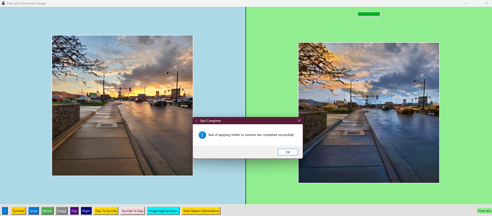

# Widescale Weather Witchcraft
<div align="center">
  
</div>


## Overview
Widescale Weather Witchcraft is a GAN-based application designed to augment road images to simulate various weather conditions. This project leverages deep learning to generate realistic transformations of clear weather road scenes into conditions such as rain, fog, and snow.

A well documented report of our work can be accessed here - [Report For Widescale Weather Witchcraft](./FinalReport.pdf)

## Project Explanation Video
Click the image below to watch our project explanation video:

[](https://www.youtube.com/watch?v=TipmDBbVJ8o)

## Results
<div align="center">
  
</div>

You Can access more results inside `BestResults` directory for translation of weather Conditions and directory `ImageSegmentation` for results on the segmentation tasks. 

## Generated Videos

<div align="center">
<table>
  <tr>
    <td></td>
    <td></td>
  </tr>
  <tr>
    <td></td>
    <td></td>
  </tr>
</table>
</div>

## App Images 

  
*Figure 1: View of the Home/Landing page for the application. Users can drag-and-drop images or videos here.*

  
*Figure 2: Image showing the loading bar on the app, indicating how much time is remaining until all images are processed.*

  
*Figure 3: Snapshot of the app's interface after images have been processed, showcasing the results.*

  
*Figure 4: Users can view some of their previously generated transformations from the last 10 minutes.*


## Prerequisites
- Windows Operating System
- Python 3.10
- GPU with CUDA support

## Installation

### 1. Install Python 3.10
Ensure that Python 3.10 is installed on your system. It is required for compatibility with TensorFlow's GPU functionalities on Windows. You can download it from [Python's official website](https://www.python.org/downloads/release/python-3100/).

### 2. Clone the Repository
Clone this repository to your local machine. Use the following command in your terminal:

```bash
git clone https://github.com/MasterKinjalk/Gan-App-For-Data-Generation.git
cd Gan-App-For-Data-Generation
```

### 3. Set Up the Python Environment
It's recommended to use a virtual environment to manage dependencies:

```bash
python -m venv venv
venv\Scripts\activate
```

### 4. Install Dependencies
Install all required Python packages from the `requirements.txt` file:

```bash
pip install -r requirements.txt
```

It is also adviced to install torch using torch's -[Start Local Website](https://pytorch.org/get-started/locally/)
This ensures you have correct CUDA and cuDNN version setup. 

### 5. Configure CUDA for TensorFlow
To use TensorFlow with GPU support, ensure that you have the correct version of CUDA and cuDNN installed. As of TensorFlow 2.10.0 (compatible with Python 3.10), CUDA 11.2 and cuDNN 8.1 are required. You can download them from NVIDIA's official site:

- [CUDA Toolkit 11.2](https://developer.nvidia.com/cuda-11.2.0-download-archive)
- [cuDNN v8.1](https://developer.nvidia.com/rdp/cudnn-archive)

Make sure to set up the environment variables correctly as per the installation guides provided by NVIDIA.

## Usage
To start the application, run the `tkinterApp.py` script after ensuring all settings are configured correctly:

```bash
python tkinterApp.py
```

## Contributing
Contributions to Widescale Weather Witchcraft are welcome! Please read `CONTRIBUTING.md` for details on our code of conduct, and the process for submitting pull requests to us.

## License
This project is licensed under the MIT License - see the `LICENSE` file for details.

## References

Here are some useful resources and references that have influenced our project:

- [CycleGAN and pix2pix GitHub repository](https://github.com/junyanz/pytorch-CycleGAN-and-pix2pix).
- [AU-GAN GitHub Repository](https://github.com/jgkwak95/AU-GAN)
- [Adversarial Unsupervised Representation Learning for Activity Time-Series Data (Research Paper)](https://arxiv.org/pdf/2103.05422.pdf)
- [Foggy CycleGAN GitHub Repository](https://github.com/ghaiszaher/Foggy-CycleGAN)
- [Berkeley DeepDrive Dataset](http://bdd-data.berkeley.edu/)
- [Summer to Winter Yosemite Dataset on Kaggle](https://www.kaggle.com/datasets/balraj98/summer2winter-yosemite/code)
- [Cityscapes Dataset](https://www.cityscapes-dataset.com/)
- [FoggySynscapes GitHub Repository](https://github.com/MartinHahner/FoggySynscapes)
- [RESIDE Standard Dehaze Datasets](https://sites.google.com/view/reside-dehazedatasets/reside-standard?authuser=0)
- [DeSnowNet: Context-Aware Deep Network for Snow Removal (Research)](https://sites.google.com/view/yunfuliu/desnownet)
- [Time of Day Dataset on Kaggle](https://www.kaggle.com/datasets/aymenkhouja/timeofdaydataset?select=nighttime)
- [Project Explanation Video on YouTube](https://www.youtube.com/watch?v=TipmDBbVJ8o)

This list includes both academic papers and practical resources that provide a foundation and tools for further exploration and understanding of our project's underlying technologies.
